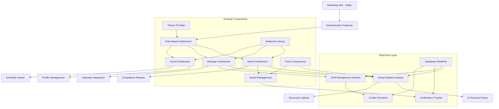

# Summit Advisory Guard Management Platform Brownfield Enhancement Architecture

**Version:** 4.0  
**Date:** 2025-01-22  
**Author:** Architect Agent  
**Project:** Summit Advisory Guard Management Platform  

## Executive Summary

This document outlines the comprehensive architectural approach for transforming the existing Summit Advisory marketing website into a dual-purpose Guard Management Platform. The enhancement preserves all existing marketing functionality while adding enterprise-grade guard lifecycle management capabilities including AI-powered hiring pipelines, real-time shift management, TOPS compliance reporting, and integrated business development tools.

## Introduction

This document outlines the architectural approach for enhancing **Summit Advisory** with a **comprehensive Guard Management Platform** that manages the complete guard lifecycle while maintaining the existing marketing website functionality. Its primary goal is to serve as the guiding architectural blueprint for AI-driven development of new features while ensuring seamless integration with the existing system.

### Relationship to Existing Architecture

This document supplements existing project architecture by defining how the new Guard Management Platform will integrate with the current Next.js 15 marketing site. The enhancement follows a **dual-application pattern** where marketing pages remain statically exported for optimal performance, while new guard management functionality operates as a separate authenticated application space within the same codebase.

### Integration Approach

Rather than replacing the existing system, this enhancement uses a **unified monorepo strategy** that leverages existing infrastructure (Next.js, Supabase, Vercel deployment) while adding new authenticated modules. Marketing functionality remains unchanged, with guard management features accessed through role-based authentication gateways.

## Existing Project Analysis

### Current Project State

- **Primary Purpose:** Professional security services marketing website with consultation request functionality
- **Current Tech Stack:** Next.js 15.3.5, React 19, TypeScript 5, Tailwind CSS 3.4.17, shadcn/ui, Supabase 2.50.5
- **Architecture Style:** JAMstack with Vercel deployment supporting both static and serverless functions
- **Deployment Method:** Static site generation with Supabase backend for dynamic functionality

### Available Documentation

- **CLAUDE.md:** Comprehensive project documentation with development guidelines, technology stack, and business context
- **PRD Documentation:** Complete sharded PRD in `docs/prd/` covering Guard Management Platform requirements
- **Component Library:** Full shadcn/ui implementation with 50+ pre-built components
- **Existing Database:** Supabase integration with `consultation_requests` table and Row-Level Security

### Identified Constraints

- **Flexible Deployment:** Can use both static export and serverless functions on Vercel
- **Authentication Disabled:** Current Supabase client has `persistSession: false` for static site optimization
- **Single Table Database:** Only `consultation_requests` table currently exists
- **Marketing Site Integrity:** Existing marketing functionality must remain unaffected
- **Performance Requirements:** Bundle analysis and optimization tools already configured

## Enhancement Scope and Integration Strategy

### Enhancement Overview

- **Enhancement Type:** Major Feature Platform Addition (Guard Lifecycle Management)
- **Scope:** Transform marketing site into dual-purpose application with complete guard operations management
- **Integration Impact:** High - Requires authentication boundaries, database expansion, and role-based access control

### Integration Approach

**Code Integration Strategy:** **Boundary-Based Monorepo Pattern**
- **Marketing Routes:** Remain static export (`/`, `/services/*`, `/qr`) - unchanged performance
- **Auth Routes:** New authenticated space (`/dashboard/*`, `/guard/*`, `/admin/*`) - full SSR capabilities  
- **Shared Components:** Leverage existing shadcn/ui component library across both spaces
- **Routing Boundary:** Next.js middleware handles authentication gates and route protection

**Database Integration:** **Additive Schema Expansion**  
- **Preserve:** Existing `consultation_requests` table remains unchanged for marketing forms
- **Add:** Comprehensive guard management schema (guards, shifts, compliance, audit_logs, user_roles)
- **Connection:** Single Supabase project with dual client configuration (public/authenticated)
- **Migration Strategy:** Incremental schema additions without disrupting existing functionality

**API Integration:** **Layered Service Architecture**
- **Marketing APIs:** Continue using existing `consultation-service.ts` pattern
- **Guard Management APIs:** New service layer (`guard-service.ts`, `shift-service.ts`, etc.)  
- **Authentication:** Supabase Auth integration with custom claims and RBAC
- **Real-time:** Supabase subscriptions for live shift updates and notifications

**UI Integration:** **Progressive Enhancement Pattern**
- **Existing UI:** Marketing components remain untouched
- **New UI:** Guard management interfaces using same design system (Tailwind + shadcn/ui)
- **Navigation:** Conditional navigation based on authentication state  
- **Theme Consistency:** Maintain existing dark theme and professional security industry branding

### Compatibility Requirements

- **Existing API Compatibility:** 100% backward compatible - no changes to marketing functionality
- **Database Schema Compatibility:** Additive only - existing table structure preserved
- **UI/UX Consistency:** Consistent design language using existing component library and styling
- **Performance Impact:** Marketing pages remain static export (no performance degradation)

## Tech Stack Alignment

### Existing Technology Stack

| Category | Current Technology | Version | Usage in Enhancement | Notes |
|----------|------------------|---------|---------------------|--------|
| **Frontend Framework** | Next.js | 15.3.5 | Full compatibility - hybrid routing | ✅ React 19 compatible |
| **UI Framework** | React | 19 | All guard management components | ✅ Latest stable |
| **Language** | TypeScript | 5 | Comprehensive type safety | ✅ Enhanced with guard data models |
| **Styling** | Tailwind CSS | 3.4.17 | Consistent design system | ✅ v4 migration path available |
| **Component Library** | shadcn/ui + Radix UI | Latest | Reuse across all interfaces | ✅ pnpm compatible, no peer dep issues |
| **Database Client** | @supabase/supabase-js | 2.50.5 | Enhanced with authentication | ✅ RLS performance optimized |
| **Forms** | React Hook Form + Zod | 7.54.1 + 3.24.1 | All guard management forms | ✅ Proven pattern |
| **Date Handling** | date-fns | 3.6.0 | Scheduling and calendar integration | ✅ Lightweight alternative to moment |
| **Deployment** | Vercel | N/A | Hybrid static/dynamic deployment | ✅ Optimized for Next.js 15 |

### New Technology Additions

| Technology | Version | Purpose | Rationale | Integration Method |
|-----------|---------|---------|-----------|-------------------|
| **OpenAI API** | Latest | Resume parsing and AI assistance | Industry-standard AI integration for automated data extraction | Supabase Edge Functions |
| **Calendar APIs** | OAuth 2.0 | Google Calendar & Outlook integration | Business requirement for shift management | Next.js API routes |
| **JWT Decode** | 4.0.0 | Custom claims extraction | Required for RBAC implementation | Client-side token parsing |

## Data Models and Schema Changes

### New Data Models

#### User Roles & Permissions (RBAC)
**Purpose:** Enterprise-grade role-based access control following Supabase RBAC patterns  
**Integration:** Links to existing `auth.users` table, no impact on marketing functionality

**Key Attributes:**
- `id`: UUID - Primary key with B-tree index  
- `user_id`: UUID - Foreign key to auth.users (indexed per advisor recommendations)
- `role`: ENUM('admin', 'manager', 'guard', 'client') - Role designation
- `permissions`: JSONB - Dynamic permission assignments for future flexibility
- `created_at/updated_at`: TIMESTAMPTZ - Audit trail timestamps

**Relationships:**
- **With Existing:** One-to-many relationship with auth.users (no changes to existing tables)
- **With New:** One-to-many relationships with guards, shifts, audit logs

#### Guards Management  
**Purpose:** Complete guard profile and certification management with TOPS compliance
**Integration:** Self-contained table with optional auth.users relationship

**Key Attributes:**
- `id`: UUID - Primary key for performance (B-tree indexed)
- `user_id`: UUID - Optional foreign key to auth.users (for guards who access system)
- `employee_number`: VARCHAR(50) - Unique identifier (unique constraint + index)
- `license_number`: VARCHAR(50) - TOPS license number (unique constraint + index)
- `license_expiry`: DATE - Compliance tracking (indexed for expiry queries)
- `certifications`: JSONB - Flexible certification storage
- `contact_info`: JSONB - Encrypted PII storage (name, email, phone, address)
- `status`: ENUM('active', 'inactive', 'suspended', 'terminated') - Employment status

**Relationships:**
- **With Existing:** Optional link to auth.users for system access
- **With New:** One-to-many with shifts, applications, compliance records

#### Hiring Pipeline (Kanban)
**Purpose:** Complete hiring workflow from lead capture to employment  
**Integration:** Extends existing consultation_requests pattern with structured pipeline

**Key Attributes:**
- `id`: UUID - Primary key with performance optimization
- `application_data`: JSONB - Flexible form data storage (parsed by AI)
- `pipeline_stage`: ENUM('lead', 'applied', 'screening', 'interview', 'background', 'approved', 'hired', 'rejected')
- `assigned_to`: UUID - Foreign key to user handling application (indexed)
- `priority`: INTEGER - Pipeline ordering and prioritization
- `ai_parsed_data`: JSONB - OpenAI extracted resume information
- `documents`: JSONB - Document references (stored in Supabase Storage)

**Relationships:**
- **With Existing:** Similar pattern to consultation_requests for consistency
- **With New:** Many-to-one with guards table upon hiring completion

#### Shift Management & Scheduling
**Purpose:** Complete shift lifecycle with calendar integration and conflict detection
**Integration:** Designed for real-time updates and calendar sync

**Key Attributes:**
- `id`: UUID - Primary key optimized for joins
- `location_data`: JSONB - Flexible location information storage
- `time_range`: TSTZRANGE - PostgreSQL range type for efficient time queries
- `assigned_guard_id`: UUID - Foreign key to guards (indexed for performance)
- `requirements`: JSONB - Shift-specific requirements and certifications needed  
- `status`: ENUM('draft', 'open', 'assigned', 'in_progress', 'completed', 'cancelled')
- `calendar_sync`: JSONB - External calendar integration metadata

**Relationships:**
- **With Existing:** Independent of marketing functionality
- **With New:** Many-to-one with guards, one-to-many with shift_logs

### Schema Integration Strategy

**Database Changes Required:**
- **New Tables:** 12 core tables (user_roles, guards, applications, shifts, compliance_records, audit_logs, etc.)
- **Modified Tables:** None - completely additive approach preserving existing functionality
- **New Indexes:** 25+ strategic indexes following performance advisor recommendations
- **Migration Strategy:** Incremental deployment with zero downtime using Supabase migrations

**Backward Compatibility:**
- All existing queries continue to work unchanged (consultation_requests table untouched)
- Marketing functionality completely isolated from guard management schema
- Existing Supabase client configuration remains functional for public features
- No breaking changes to current API endpoints or database structure

## Component Architecture

### New Components

#### Dashboard Layout System
**Responsibility:** Role-based dashboard container with real-time navigation  
**Integration Points:** Extends existing layout.tsx patterns with authentication boundaries

**Key Interfaces:**
- `useAuth()` - Enhanced authentication hook with role-based access
- `useRealTimeNotifications()` - Live updates for shift changes, applications, compliance alerts
- `<ProtectedRoute>` - Authorization wrapper component

**Dependencies:**
- **Existing Components:** Leverages current navbar.tsx, theme-provider.tsx patterns
- **New Components:** RoleBasedNavigation, NotificationCenter, StatusIndicators

**Technology Stack:** Next.js App Router with Server Components for initial render, Client Components for real-time features

#### Kanban Workflow Components  
**Responsibility:** Drag-and-drop workflow management for hiring pipeline and shift scheduling
**Integration Points:** Reuses existing shadcn/ui components (Card, Dialog, Badge) with drag-and-drop functionality

**Key Interfaces:**
- `<KanbanBoard>` - Generic workflow board component
- `<KanbanCard>` - Individual item with real-time updates  
- `<KanbanColumn>` - Status-based columns with counts and filters
- `useDragAndDrop()` - Custom hook for workflow state management

**Dependencies:**
- **Existing Components:** Built on shadcn/ui Card, Dialog, Button, Badge components
- **New Components:** WorkflowActions, StatusBadges, PriorityIndicators

**Technology Stack:** React 19 with @dnd-kit for accessibility-compliant drag-and-drop, Supabase real-time for live collaboration

#### Guard Profile Management
**Responsibility:** Complete guard lifecycle from application through employment
**Integration Points:** Extends existing form patterns from contact.tsx with enhanced validation

**Key Interfaces:**
- `<GuardProfileForm>` - Multi-step profile creation with AI-powered resume parsing
- `<DocumentUpload>` - Secure file handling with Supabase Storage integration
- `<CertificationTracker>` - TOPS compliance monitoring with expiry alerts
- `useGuardProfile()` - Complete CRUD operations with optimistic updates

**Dependencies:**
- **Existing Components:** Builds on React Hook Form + Zod patterns from consultation forms
- **New Components:** AIResumeParser, ComplianceChecker, DocumentViewer

**Technology Stack:** React Hook Form + Zod for validation, OpenAI API integration for resume parsing, Supabase Storage for documents

#### Calendar Integration System
**Responsibility:** Bi-directional calendar synchronization with shift conflict detection  
**Integration Points:** New feature extending existing date handling patterns

**Key Interfaces:**
- `<ShiftCalendar>` - Visual scheduling interface with conflict detection
- `<CalendarSync>` - External calendar integration (Google/Outlook)
- `<ConflictResolver>` - Automatic conflict detection and resolution suggestions
- `useCalendarIntegration()` - OAuth integration with external calendar APIs

**Dependencies:**
- **Existing Components:** Leverages existing date-fns usage patterns
- **New Components:** TimeSlotPicker, AvailabilityMatrix, ShiftAssignmentWizard

**Technology Stack:** React Big Calendar for visualization, OAuth 2.0 for external integrations, Supabase real-time for live updates

### Component Interaction Diagram



## API Design and Integration

### API Integration Strategy

**API Integration Strategy:** Layered Serverless Architecture with Security-First Design  
**Authentication:** Supabase JWT tokens with custom claims for RBAC  
**Versioning:** Semantic API versioning with backward compatibility (`/api/v1/`)

### New API Endpoints

#### Guard Management APIs
**Purpose:** Complete CRUD operations for guard profiles and lifecycle management  
**Integration:** Builds on existing consultation-service.ts patterns with enhanced security

**Core Endpoints:**
- `POST /api/v1/guards` - Create new guard profile with AI resume parsing
- `GET /api/v1/guards` - List guards with role-based filtering and pagination  
- `PUT /api/v1/guards/:id` - Update guard information with audit logging
- `DELETE /api/v1/guards/:id` - Deactivate guard (soft delete for compliance)

**Request/Response Example:**
```json
// POST /api/v1/guards
{
  "personal_info": {
    "first_name": "John",
    "last_name": "Doe", 
    "email": "john@example.com"
  },
  "resume_file": "base64_encoded_document",
  "certifications": []
}

// Response
{
  "success": true,
  "data": {
    "id": "uuid",
    "profile_data": {...},
    "ai_parsed_skills": [...],
    "compliance_status": "pending"
  }
}
```

#### Hiring Pipeline APIs  
**Purpose:** Kanban workflow management with real-time collaboration
**Integration:** Supabase real-time subscriptions for live board updates

**Core Endpoints:**
- `POST /api/v1/applications` - Submit new application with document upload
- `PUT /api/v1/applications/:id/stage` - Move application through pipeline stages
- `GET /api/v1/applications/board` - Get Kanban board data with real-time subscription
- `POST /api/v1/applications/:id/ai-parse` - Trigger AI resume parsing

#### Calendar Integration APIs
**Purpose:** Bi-directional calendar sync with conflict detection
**Integration:** OAuth 2.0 integration with Google Calendar and Microsoft Graph APIs

**Core Endpoints:**
- `POST /api/v1/calendar/connect` - OAuth connection to external calendar
- `GET /api/v1/calendar/availability/:guard_id` - Get guard availability from calendar
- `POST /api/v1/shifts/:id/sync` - Sync shift to external calendar
- `GET /api/v1/calendar/conflicts` - Detect and resolve scheduling conflicts

### External API Integration

#### OpenAI API Integration
**Purpose:** AI-powered resume parsing and data extraction  
**Implementation:** Supabase Edge Function for secure API key management

**Edge Function Example:**
```typescript
// supabase/functions/ai-resume-parser/index.ts
import { createClient } from '@supabase/supabase-js'
import OpenAI from 'openai'

Deno.serve(async (req) => {
  const { document_text, application_id } = await req.json()
  
  const openai = new OpenAI({
    apiKey: Deno.env.get('OPENAI_API_KEY')
  })
  
  const completion = await openai.chat.completions.create({
    model: "gpt-4",
    messages: [{
      role: "system",
      content: "Extract structured data from this resume for guard hiring..."
    }, {
      role: "user", 
      content: document_text
    }]
  })
  
  // Store parsed data with audit trail
  const parsed_data = JSON.parse(completion.choices[0].message.content)
  
  return new Response(JSON.stringify({
    success: true,
    parsed_data,
    confidence_score: 0.95
  }))
})
```

#### Google Calendar API Integration
**Purpose:** Bi-directional shift synchronization with conflict detection
**Implementation:** OAuth 2.0 server-side flow with refresh token management

#### Microsoft Graph API Integration
**Purpose:** Outlook calendar integration for comprehensive calendar support
**Implementation:** MSAL authentication with Microsoft Graph SDK

## Source Tree Integration

### New File Organization
Following Next.js route groups and private folder patterns:

```plaintext
summit-advisory-vercel/
├── app/                           # Enhanced App Router structure
│   ├── (marketing)/              # Route group - public marketing pages
│   │   ├── layout.tsx            # Marketing-specific layout
│   │   ├── page.tsx              # Homepage (moved from root)
│   │   ├── services/             # Service pages (existing)
│   │   └── qr/                   # QR system (existing)
│   ├── (auth)/                   # Route group - authentication
│   │   ├── login/
│   │   │   └── page.tsx          # Login page
│   │   ├── register/
│   │   │   └── page.tsx          # Guard registration
│   │   └── layout.tsx            # Auth layout
│   ├── dashboard/                # Guard management routes
│   │   ├── (admin)/              # Route group - admin features
│   │   │   ├── guards/           # Guard management
│   │   │   ├── hiring/           # Hiring pipeline
│   │   │   └── compliance/       # Compliance reporting
│   │   ├── (manager)/            # Route group - manager features  
│   │   │   ├── shifts/           # Shift management
│   │   │   └── scheduling/       # Advanced scheduling
│   │   ├── (guard)/              # Route group - guard features
│   │   │   ├── profile/          # Guard self-service
│   │   │   ├── schedule/         # View schedule
│   │   │   └── availability/     # Set availability
│   │   └── layout.tsx            # Dashboard layout
│   ├── api/                      # API routes
│   │   └── v1/                   # Versioned API
│   │       ├── guards/           # Guard management API
│   │       ├── applications/     # Hiring pipeline API
│   │       ├── shifts/           # Shift management API
│   │       └── calendar/         # Calendar integration API
│   └── _components/              # Private folder - internal components
├── components/                   # Enhanced component library
│   ├── ui/                       # shadcn/ui components (preserved)
│   ├── dashboard/                # Dashboard-specific components
│   ├── charts/                   # Analytics components
│   └── calendar/                 # Calendar components
├── lib/                          # Enhanced service layer
│   ├── auth/                     # Authentication services
│   ├── services/                 # Business logic services
│   ├── api/                      # API utilities
│   ├── utils/                    # Utility functions
│   └── types/                    # TypeScript definitions
├── hooks/                        # Enhanced custom hooks
│   ├── auth/                     # Authentication hooks
│   ├── data/                     # Data management hooks
│   └── ui/                       # UI-specific hooks
└── supabase/                     # Supabase Edge Functions
    └── functions/
        ├── ai-resume-parser/     # OpenAI integration
        ├── calendar-sync/        # Calendar synchronization
        └── notification-handler/ # Real-time notifications
```

### Integration Guidelines

**File Naming Consistency:**
- **Components:** PascalCase.tsx (GuardProfileForm.tsx)
- **Services:** kebab-case.ts (guard-service.ts)
- **Hooks:** use-kebab-case.ts (use-auth.ts)
- **Types:** kebab-case.ts (api-types.ts)

**Import/Export Patterns:**
- **Barrel Exports:** Each major directory includes index.ts for clean imports
- **Path Aliases:** All imports use @/ prefix for consistency with existing pattern
- **Type-Only Imports:** Use `import type` for TypeScript definitions

## Infrastructure and Deployment Integration

### Enhancement Deployment Strategy

**Deployment Approach:** **Unified Vercel Strategy**  
- **Marketing Pages:** Static export optimized for Vercel deployment
- **Guard Management:** Full Next.js capabilities with serverless functions on Vercel
- **Database:** Single Supabase project with expanded schema
- **Edge Functions:** Supabase Edge Functions for serverless API logic

**Infrastructure Changes:**
- **Single Deployment Target:** Vercel for entire application (marketing + guard management)
- **DNS Configuration:** Single domain with route-based functionality
- **Environment Variables:** Unified Vercel environment configuration
- **CI/CD Pipeline:** GitHub Actions integrated with Vercel deployment

### Pipeline Integration

**GitHub Actions Workflow:**
```yaml
# .github/workflows/deploy.yml
name: Multi-Platform Deployment

on:
  push:
    branches: [main]
  pull_request:
    branches: [main]

jobs:
  # Database migrations first
  migrate-database:
    runs-on: ubuntu-latest
    steps:
      - uses: actions/checkout@v4
      - name: Apply Supabase Migrations
        run: |
          npx supabase db push --linked
        env:
          SUPABASE_ACCESS_TOKEN: ${{ secrets.SUPABASE_ACCESS_TOKEN }}

  # Deploy Edge Functions
  deploy-edge-functions:
    needs: migrate-database
    runs-on: ubuntu-latest
    steps:
      - uses: actions/checkout@v4
      - name: Deploy Edge Functions
        run: |
          npx supabase functions deploy
        env:
          SUPABASE_ACCESS_TOKEN: ${{ secrets.SUPABASE_ACCESS_TOKEN }}

  # Full application to Vercel
  deploy-vercel:
    needs: [migrate-database, deploy-edge-functions]
    runs-on: ubuntu-latest
    steps:
      - uses: actions/checkout@v4
      - uses: amondnet/vercel-action@v25
        with:
          vercel-token: ${{ secrets.VERCEL_TOKEN }}
          vercel-org-id: ${{ secrets.VERCEL_ORG_ID }}
          vercel-project-id: ${{ secrets.VERCEL_PROJECT_ID }}
```

### Rollback Strategy

**Rollback Method:** **Automated Rollback with Health Checks**
- **Database Rollback:** Supabase migration rollback with data preservation
- **Application Rollback:** Vercel instant rollback to previous deployment
- **Health Monitoring:** Automated health checks trigger rollback if needed

**Risk Mitigation:**
- **Blue-Green Deployment:** Zero-downtime updates using Vercel preview URLs
- **Database Backup:** Automated daily backups before major migrations
- **Feature Flags:** Gradual feature rollout with instant disable capability
- **Monitoring Alerts:** Real-time alerts for system failures or performance degradation

**Monitoring:** 
- **Vercel Analytics:** Performance monitoring for guard management routes
- **Supabase Monitoring:** Database performance and Edge Function health
- **Custom Alerts:** Critical workflow failures (hiring pipeline, shift assignments)
- **Uptime Monitoring:** 24/7 system availability tracking

## Coding Standards and Conventions

### Existing Standards Compliance

**Code Style:** TypeScript 5 with strict mode, ESLint with Next.js rules, Prettier formatting  
**Linting Rules:** `@next/eslint-plugin-next`, `eslint-plugin-react`, `eslint-plugin-react-hooks`  
**Testing Patterns:** Manual testing with consultation form validation patterns  
**Documentation Style:** JSDoc comments for complex functions, inline TypeScript types

### Enhancement-Specific Standards

#### TypeScript Conventions
```typescript
// Use descriptive, clear naming
interface GuardProfileFormProps {
  guard?: Guard
  onSubmit: (data: GuardFormData) => Promise<void>
  onCancel: () => void
}

// Prefer type imports for better tree shaking
import type { Guard, Shift } from '@/lib/types'

// Use branded types for additional type safety
export type GuardId = string & { readonly __brand: unique symbol }

// Comprehensive error handling with discriminated unions
export type ServiceResult<T> = 
  | { success: true; data: T }
  | { success: false; error: string; code: ErrorCode }
```

#### Component Architecture Standards
```typescript
// Memoized functional components with proper TypeScript
export const GuardProfileForm = React.memo(function GuardProfileForm({
  guard,
  onSubmit,
  onCancel
}: GuardProfileFormProps) {
  // Custom hooks for logic extraction
  const { form, isLoading, errors } = useGuardForm(guard)
  
  // Memoized values to prevent unnecessary re-renders
  const validationSchema = useMemo(() => 
    createGuardValidationSchema(guard?.status), [guard?.status]
  )
  
  return (
    <form onSubmit={form.handleSubmit(handleFormSubmit)}>
      {/* Form implementation */}
    </form>
  )
})
```

### Critical Integration Rules

**Existing API Compatibility:** All new APIs follow existing consultation-service.ts patterns  
**Database Integration:** Additive schema changes only, zero breaking changes to existing tables  
**Error Handling:** Consistent error response format matching existing ServiceResult pattern  
**Logging Consistency:** All Guard Management operations logged with same format as consultation requests

## Testing Strategy

### Integration with Existing Tests

**Existing Test Framework:** Manual testing for consultation requests and marketing functionality  
**Test Organization:** Create `tests/` directory with separate folders for unit, integration, and database tests  
**Coverage Requirements:** Target 90%+ coverage for critical workflows (hiring pipeline, shift management, compliance)

### New Testing Requirements

#### Unit Tests for New Components
**Framework:** Jest + React Testing Library (Next.js standard)  
**Location:** `__tests__/` directories co-located with components  
**Coverage Target:** 95% coverage for business logic, 85% for UI components  
**Integration with Existing:** Extends current manual testing approach with automated coverage

#### Database Tests with pgTAP
**Scope:** RLS policies, data integrity, TOPS compliance rules  
**Framework:** pgTAP with Supabase CLI integration  
**Location:** `supabase/tests/database/`

```sql
-- supabase/tests/database/guard_rls.test.sql  
BEGIN;
SELECT plan(8);

-- Setup test users with unique IDs to avoid conflicts
INSERT INTO auth.users (id, email) VALUES
  ('550e8400-e29b-41d4-a716-446655440001', 'admin@test.com'),
  ('550e8400-e29b-41d4-a716-446655440002', 'manager@test.com'), 
  ('550e8400-e29b-41d4-a716-446655440003', 'guard@test.com');

-- Test RLS policies with different roles
SET LOCAL role authenticated;
SET LOCAL request.jwt.claim.sub = '550e8400-e29b-41d4-a716-446655440001';

SELECT results_eq(
  'SELECT COUNT(*) FROM guards',
  ARRAY[2::bigint],
  'Admin should see all guards'
);

SELECT * FROM finish();
ROLLBACK;
```

#### Integration Tests
**Scope:** Complete workflows from UI to database with authentication  
**Framework:** Playwright for end-to-end testing  
**Testing:** Real browser automation with Supabase backend

#### Regression Testing
**Existing Feature Verification:** Automated tests ensure marketing site functionality remains intact  
**Automated Regression Suite:** GitHub Actions CI pipeline runs full test suite on every PR  
**Manual Testing Requirements:** Critical business workflows tested manually before release

### CI/CD Testing Pipeline

```yaml
# .github/workflows/test.yml
name: Test Suite

on:
  push:
    branches: [main]
  pull_request:
    branches: [main]

jobs:
  # Database tests first
  database-tests:
    runs-on: ubuntu-latest
    steps:
      - uses: actions/checkout@v4
      - uses: supabase/setup-cli@v1
      - name: Start Supabase
        run: supabase start
      - name: Run Database Tests  
        run: supabase test db
        
  # Unit tests
  unit-tests:
    runs-on: ubuntu-latest
    steps:
      - uses: actions/checkout@v4
      - uses: actions/setup-node@v4
        with:
          node-version: '22'
          cache: 'pnpm'
      - run: pnpm install --frozen-lockfile
      - run: pnpm run test:unit
      - run: pnpm run test:coverage

  # E2E tests
  e2e-tests:
    needs: [database-tests, unit-tests]
    runs-on: ubuntu-latest
    steps:
      - uses: actions/checkout@v4
      - uses: actions/setup-node@v4
        with:
          node-version: '22'
          cache: 'pnpm'
      - run: pnpm install --frozen-lockfile
      - run: pnpm exec playwright install
      - run: pnpm run test:e2e
        env:
          SUPABASE_URL: ${{ secrets.SUPABASE_URL }}
          SUPABASE_ANON_KEY: ${{ secrets.SUPABASE_ANON_KEY }}
```

## Security Integration

### Existing Security Measures
**Authentication:** Current Supabase client with disabled persistence for static sites  
**Authorization:** No current role-based access (marketing site is public)  
**Data Protection:** Basic form validation for consultation requests  
**Security Tools:** Standard Next.js security headers and HTTPS

### Enhancement Security Requirements
**New Security Measures:** JWT-based authentication with custom claims for RBAC  
**Integration Points:** Supabase Auth integration with role-based dashboard access  
**Compliance Requirements:** TOPS compliance with audit trails for all guard management operations

### Security Testing
**Existing Security Tests:** Manual validation of consultation form submissions  
**New Security Test Requirements:** Automated RLS policy testing, authentication flow validation  
**Penetration Testing:** Role-based access control validation across all user types

## Next Steps

### Story Manager Handoff

Create the first implementation story focusing on authentication infrastructure:

**Story: Authentication System Foundation**
- Reference this architecture document for technical decisions
- Implement dual Supabase client configuration (public/authenticated)
- Set up basic role-based dashboard structure with route groups
- Create authentication middleware for route protection
- Establish user role management with Supabase RLS policies
- Verify integration doesn't affect existing marketing site functionality

**Integration Checkpoints:**
- Marketing site remains fully functional during development
- Authentication boundaries properly isolate public and private features
- Database migrations are additive-only with zero downtime
- All new code follows existing TypeScript and component patterns

### Developer Handoff

**Technical Implementation Guide:**
- Follow this architecture document for all technical decisions
- Use existing coding standards with TypeScript strict mode
- Implement components using established shadcn/ui patterns
- Follow existing service layer architecture (consultation-service.ts pattern)
- Ensure all database operations include proper RLS policies and audit logging
- Maintain existing build and deployment processes during development

**Key Technical Requirements:**
- Preserve marketing site performance (static export)
- Follow existing TypeScript interfaces and error handling patterns
- Use established React Hook Form + Zod validation approach
- Implement proper security boundaries between marketing and guard management
- Ensure real-time features degrade gracefully without JavaScript

**Implementation Sequence:**
1. **Phase 1:** Authentication infrastructure and basic dashboard routing
2. **Phase 2:** Guard profile management with document upload
3. **Phase 3:** Hiring pipeline Kanban with AI resume parsing
4. **Phase 4:** Shift management and calendar integration
5. **Phase 5:** Compliance reporting and audit dashboard

---

## Change Log

| Date | Version | Description | Author |
|------|---------|-------------|--------|
| 2025-01-22 | 4.0 | Complete brownfield architecture for Guard Management Platform | Architect Agent |

---

*🤖 Generated with [Claude Code](https://claude.ai/code)*

*Co-Authored-By: Claude <noreply@anthropic.com>*