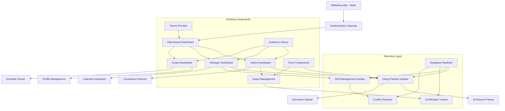

# Component Architecture

## New Components

### Dashboard Layout System
**Responsibility:** Role-based dashboard container with real-time navigation  
**Integration Points:** Extends existing layout.tsx patterns with authentication boundaries

**Key Interfaces:**
- `useAuth()` - Enhanced authentication hook with role-based access
- `useRealTimeNotifications()` - Live updates for shift changes, applications, compliance alerts
- `<ProtectedRoute>` - Authorization wrapper component

**Dependencies:**
- **Existing Components:** Leverages current navbar.tsx, theme-provider.tsx patterns
- **New Components:** RoleBasedNavigation, NotificationCenter, StatusIndicators

**Technology Stack:** Next.js App Router with Server Components for initial render, Client Components for real-time features

### Kanban Workflow Components  
**Responsibility:** Drag-and-drop workflow management for hiring pipeline and shift scheduling
**Integration Points:** Reuses existing shadcn/ui components (Card, Dialog, Badge) with drag-and-drop functionality

**Key Interfaces:**
- `<KanbanBoard>` - Generic workflow board component
- `<KanbanCard>` - Individual item with real-time updates  
- `<KanbanColumn>` - Status-based columns with counts and filters
- `useDragAndDrop()` - Custom hook for workflow state management

**Dependencies:**
- **Existing Components:** Built on shadcn/ui Card, Dialog, Button, Badge components
- **New Components:** WorkflowActions, StatusBadges, PriorityIndicators

**Technology Stack:** React 19 with @dnd-kit for accessibility-compliant drag-and-drop, Supabase real-time for live collaboration

### Guard Profile Management
**Responsibility:** Complete guard lifecycle from application through employment
**Integration Points:** Extends existing form patterns from contact.tsx with enhanced validation

**Key Interfaces:**
- `<GuardProfileForm>` - Multi-step profile creation with AI-powered resume parsing
- `<DocumentUpload>` - Secure file handling with Supabase Storage integration
- `<CertificationTracker>` - TOPS compliance monitoring with expiry alerts
- `useGuardProfile()` - Complete CRUD operations with optimistic updates

**Dependencies:**
- **Existing Components:** Builds on React Hook Form + Zod patterns from consultation forms
- **New Components:** AIResumeParser, ComplianceChecker, DocumentViewer

**Technology Stack:** React Hook Form + Zod for validation, OpenAI API integration for resume parsing, Supabase Storage for documents

### Calendar Integration System
**Responsibility:** Bi-directional calendar synchronization with shift conflict detection  
**Integration Points:** New feature extending existing date handling patterns

**Key Interfaces:**
- `<ShiftCalendar>` - Visual scheduling interface with conflict detection
- `<CalendarSync>` - External calendar integration (Google/Outlook)
- `<ConflictResolver>` - Automatic conflict detection and resolution suggestions
- `useCalendarIntegration()` - OAuth integration with external calendar APIs

**Dependencies:**
- **Existing Components:** Leverages existing date-fns usage patterns
- **New Components:** TimeSlotPicker, AvailabilityMatrix, ShiftAssignmentWizard

**Technology Stack:** React Big Calendar for visualization, OAuth 2.0 for external integrations, Supabase real-time for live updates

## Component Interaction Diagram

